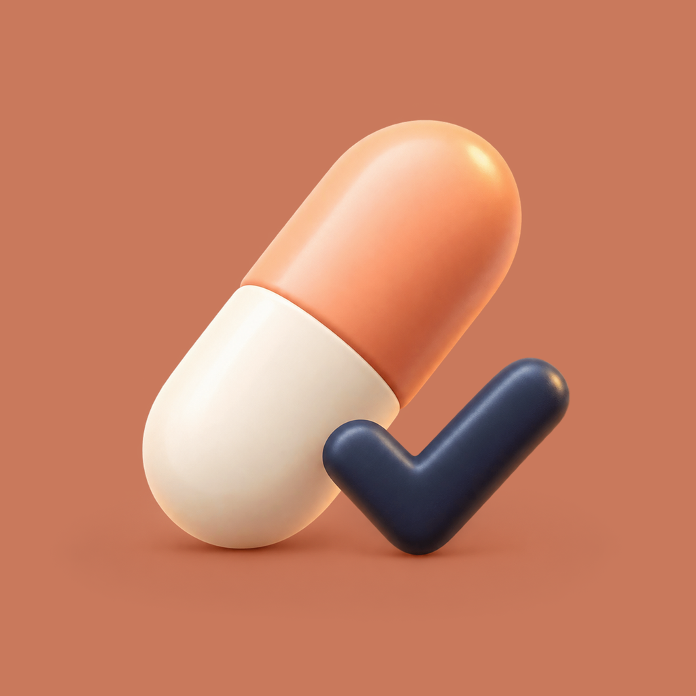
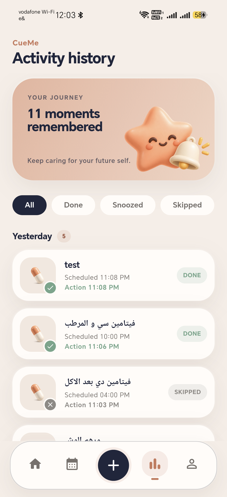

# CueMe

<p align="center">
  
</p>

<p align="center">
  A warm, friendly reminder app for medicines, vitamins, skincare,
  supplements, bills, and everyday routines.
</p>

<p align="center">
  <a href="https://github.com/MohamedAbdelhamed0/cueme/releases/latest/download/CueMe-v2.0.0-android.apk">
    
  </a>
</p>


## CueMe Version 2

Version 2 introduces a complete visual refresh inspired by calm wellness apps:

- Warm peach, ivory, and navy color system
- Illustrated home, routines, history, and editor screens
- Calendar-based routine planning
- Dedicated artwork for medicine, vitamins, skincare, bills, and more
- Recorded voice reminders, system sounds, vibration, and snooze controls
- Reliable scheduled notifications, including while the app is closed
- Light and dark themes

## Actual app preview

<p align="center">
  
</p>

## Download

Download the latest Android APK from the
[GitHub Releases page](https://github.com/MohamedAbdelhamed0/cueme/releases/latest),
then open the downloaded file on your Android device to install CueMe.

Android may ask you to allow installation from your browser or file manager.

## Development

CueMe is built with Flutter and Riverpod. To run it locally:

```bash
flutter pub get
flutter run
```

Run the project checks with:

```bash
flutter analyze
flutter test
```
